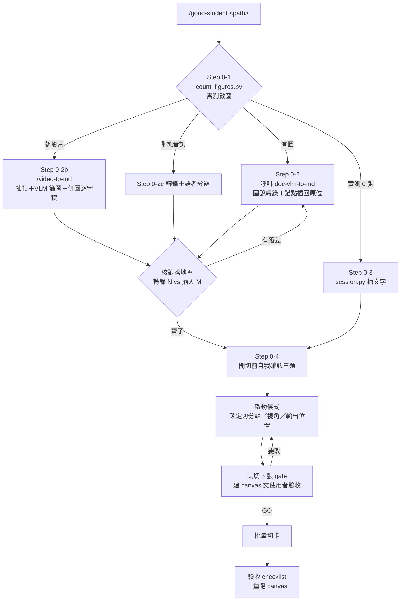

# /good-student — 知識點線（concept-level chunking with memory hooks）

把長文本蒸餾成「一概念一檔、看完記得住」的知識點。這條線的存在理由：
整段式筆記（含 Step 4 好學生筆記）敘述完整但**沒有記憶點，看過就忘**；
概念級 chunk 檢索友善但如果只是內容轉述會**太籠統**。本線同時解兩件事：
**切法承襲 domain-structure chunking，記憶點承襲好學生筆記的視角置入**。

## 一次跑完的流程（`/good-student <path>`）

**本 skill 是入口，`doc-vlm-to-md` 是它的子步驟。** 給一個路徑就從頭走到尾：



**兩道 gate 都是鐵門，auto mode 也不能跳**：
Step 0 的圖片閘門（沒轉完不准切）、試切 5 張的驗收（沒 GO 不准批量）。

---

## 定位（與既有產線的關係，先讀懂再動手）

- **本線是「蒸餾產物」，與零省略產線平行、不取代。** CLAUDE.md 的零省略鐵律
  管的是 Step 2/3/4（cleaned.md／enhanced.md／notes 都必須 95–105% 保字數）；
  知識點是改寫濃縮（同 `confidence: distilled` 語意），兩者是不同產品，
  **絕不要拿零省略 checklist 驗知識點，也絕不要拿知識點取代 cleaned.md**。
- **輸入介面＝原始檔路徑或乾淨長文本，兩種都收。**
  給原始檔（EPUB/PDF/音檔/影片/TXT）就走下方 **Step 0 前置轉檔**，本 skill 自己接完；
  給現成文本（貼文、講義、別處的逐字稿）就直接進啟動儀式。
  **使用者不需要先手動跑 session.py**——`/good-student <path>` 一次跑完是預設行為。
- 原始檔是 parent、知識點是 child：每檔 `source`（＋有時間軸時 `source_ts`）
  指回原文，不複製原文進知識庫、不維護雙索引。

## Step 0 — 前置轉檔與圖片閘門（**強制，先過這關才准切卡**）

給的是原始檔就先走這一步。**這關沒過不准開始切卡**——
2026-09-07 大耕紫微線的事故：428 張卡全部切在殘缺語料上，因為
EPUB 的 1,010 張內嵌圖從來沒進過管線，而 `session.py` 只抽文字層、不抽圖、不報錯。
後果不只是少了圖：「原書沒寫」這類結論一路寫進缺口清單與檢索器，
連**缺口的形狀**都判錯，補圖後回頭重驗的成本遠高於一開始先轉完。

### 0-1　先數圖（不看副檔名推論）

```bash
python3 <mars-cc>/000_Agent/skills/doc-vlm-to-md/scripts/count_figures.py <檔案或目錄>
```

**實測 0 張才算沒有圖。** 不可以因為「這是 EPUB／這是純文字」就跳過。

它會分三種回覆：

| 回覆 | 意思 | 下一步 |
| :--- | :--- | :--- |
| `N 張` | 實測有 N 張圖 | N>0 → 0-2；N=0 → 0-3 |
| 🎬 `影片` | **畫面資訊不在這支的統計裡** | → **0-2b 影片線** |
| ❗ `格式不支援、未清點` | 它不會數這種檔 | **不可當作沒有圖**，人工確認 |

### 0-2　有圖就先轉完，再切卡

有圖 → 走 `doc-vlm-to-md` skill 把圖說轉錄並用錨點插回 `cleaned.md` 原位，
**整份轉完**才進啟動儀式。不要邊切卡邊補圖——
圖沒進語料前切出來的卡會帶著「原書沒寫」這種錯誤結論，每一張都要回頭重驗。

轉完**核對落地率**（轉錄 N 張 vs 實際插入 M 張）。merge 只會印「塞回 N 張」，
N 少了看不出來；實測曾靜默丟失 74 張。

### 0-2b　影片走 `/video-to-md`，不要只抽音軌

影片的「圖」在畫面裡：投影片、demo、圖表、程式碼、白板。
`/video-to-md` 會場景偵測抽幀，再用地端 VLM 依
**「只聽逐字稿會漏掉」** 這個判準篩圖寫圖說，最後用時間戳併回逐字稿。

⚠️ **只跑 `audio-to-md` 只會拿到聲音**——一場有投影片的演講等於丟掉一半資訊，
而且會產生跟 EPUB 缺圖一樣的假象：「逐字稿裡沒提到 X」，其實 X 一直在投影片上。

畫面確實沒有資訊（純談話、podcast 錄影）才回頭走 `audio-to-md`。

### 0-2c　音訊走「轉錄 + 語者分辨」雙線

純音訊也要先過這關。**這關沒過不准往下切卡**——轉錄與語者分辨分兩條線跑，最後再對齊。

#### 抽音軌

> **走 `transcribe_local.py` / `transcribe_llmnode.py` 就不用自己抽**——兩支腳本都會抽好
> 16k 單聲道再送進推理。這節是手動路徑（走下方 VAD 備案時）與 `.qta` 結構的說明。

```bash
ffmpeg -map 0:a:0 -ac 1 -ar 16000 -c:a pcm_s16le
```

iPhone 語音備忘錄是 `.qta`（QuickTime 容器）。第一軌 `aac` stereo 才是拿來轉錄的。

第二軌是 `apac`（Apple 專有 first-order Ambisonics，ACN/SN3D）。ffmpeg 解不開，`afconvert` 沒有選軌參數；要解得自己寫 AVFoundation。

⚠️ 方位分離（DOA）在室內談話錄音上實測無效。殘響會打亂方位；拿語意去驗就破了：標成「對面方位」的句子，語意上全是主講者的話。不要為了分語者去碰這條。

#### 轉錄：三條 ASR 路徑，先選對再動手

**預設走 `transcribe_local.py`（Mac 的 mlx-whisper）。** 2026-07-27 MM 拍板轉錄主線改本地，
裝在 `.venv-audio`（mlx-whisper 0.4.3 ＋ mlx-metal）。**39.5 分鐘音檔實測約 84 秒。**

| 路徑 | 引擎 | 跑在哪 | 速度 | 什麼時候用 |
| :--- | :--- | :--- | :--- | :--- |
| `scripts/audio/transcribe_local.py` | mlx-whisper | Mac（Apple Silicon MLX） | 39.5 分 → **84 秒** | **預設** |
| `scripts/audio/transcribe_llmnode.py` | whisper.cpp | llm-node（Intel Linux 14 核） | 約 2.75x realtime | 材料本來就在 llm-node；或 Mac 要留著做別的事 |
| llm-node 上手動 `whisper-cli` | whisper.cpp ＋ **VAD** | llm-node | RTF 0.29 | **只有這條有 VAD**——重複迴圈時的唯一解，見下方備案 |

兩支腳本**同契約**（同 CLI、同產物：SRT ＋ `words.json`），差別只在推理跑在哪，
下游 QAQC/cleaned 不需要任何改動。

```bash
# 預設
.venv-audio/bin/python scripts/audio/transcribe_local.py <media> -o transcript.srt \
    [--context context.txt] [--language zh]

# 材料已在 llm-node，或 Mac 要留著做別的事
.venv-audio/bin/python scripts/audio/transcribe_llmnode.py <media> -o transcript.srt \
    [--context context.txt] [--language zh] [--remote-media <llm-node 上的路徑>]
```

⚠️ **Mac 上沒有 whisper.cpp**（沒有 `~/whisper.cpp`，homebrew 也沒裝）。
本檔舊版寫的那條裸 `whisper-cli … --vad …` 指令**在 Mac 上跑不起來**——whisper.cpp 只在 llm-node。

⚠️ **VAD 只有 whisper.cpp 有，而上面兩支腳本都沒有帶 VAD、也沒帶 `-mc 0`。**
所以重複迴圈要靠 VAD 解時，得手動走 llm-node（備案那節），或把 VAD 參數加進腳本。

**llm-node 上的東西在哪**（`transcribe_llmnode.py` 的 `ASR_DEFAULTS` 就是這些值）：

| 東西 | 路徑 |
| :--- | :--- |
| `whisper-cli` | `~/whisper.cpp/build/bin/whisper-cli` |
| 模型 | `~/models/ggml-large-v3-turbo-q8_0.bin`（874MB，server 也用這個）／`ggml-large-v3-q5_0.bin`（1.1GB）／`ggml-large-v2-q8_0.bin`（1.7GB） |
| VAD 模型 | `~/whisper.cpp/models/for-tests-silero-v6.2.0-ggml.bin`（885KB） |

⚠️ `~/whisper.cpp/models/` 底下的 `for-tests-ggml-large/medium/small.bin` **全是 whisper.cpp
的測試 fixture**（都只有 575KB，真的 large 是 1.7GB）——拿它們轉錄會得到垃圾。
真模型只在 `~/models/`。唯一例外是同目錄的 Silero VAD 檔，那個 885KB 是真的可用。

`transcribe_llmnode.py` 已經處理掉的事：Mac 抽 16k 單聲道 wav → scp 上傳
（15 分鐘的課約 29MB，比傳原片省）→ **分段**轉錄 → 段落 JSON 的 `offsets` 平移回
全域時間軸合併 → opencc → SRT ＋ `words.json`。`--remote-media` 給了就不上傳。
收工自己刪遠端暫存檔（要留檔用 `--keep-remote`）。

**不要自己組 ssh 指令**——與語者分辨同一個原則：先找既有能跑的工具。

#### 分段與 VAD 解的是**兩件不同的事**，不要混

| 手段 | 解什麼 | 證據 |
| :--- | :--- | :--- |
| **分段**（420/480s，腳本預設） | 長檔單次跑會讓 **ssh 連線撐不住**（106 分鐘那集實測失敗）；失敗只賠一段 | ADR-2026-09-07 |
| **VAD ＋ `-mc 0`** | 30 分鐘以上中文長檔的**重複迴圈**（同一句洗版到檔尾） | 2026-09-26 實測，37 分鐘錄音從 01:28 重複到結束 |

⚠️ **分段解決不了重複迴圈，也解決不了零標點。** ADR-2026-09-07 初版把零標點歸因於
「跨段漂移」，後來被推翻：把中招的音檔單獨拉出來（390 秒）帶同一份 prompt 跑，
前 90 秒照樣 0 標點。**「跑得完」曾被誤讀成「修好了」。**

#### 備案：在 llm-node 上直呼 whisper-cli（開 VAD）

重複迴圈實測對照（37 分鐘中文對話）：

| 設定 | unique 句 | 速度 |
| :--- | :--- | :--- |
| 原樣（server 帶 `--carry-initial-prompt`） | 40%（作廢） | RTF 0.41 |
| `-mc 0`（等同 no-context） | 60%，仍重複 | RTF 0.73 |
| `-mc 0` ＋ Silero VAD | 93–95% | RTF 0.29 |

```bash
# 在 llm-node 上跑（音檔要先傳上去）
ssh llm-node '~/whisper.cpp/build/bin/whisper-cli \
  -m ~/models/ggml-large-v3-turbo-q8_0.bin -f in.wav -l zh -mc 0 -t 12 \
  --vad -vm ~/whisper.cpp/models/for-tests-silero-v6.2.0-ggml.bin \
  -vp 300 -vsd 300 -vmsd 30 -vt 0.4 -ojf -of out --prompt "以下是繁體中文的對話錄音。"'
```

- `for-tests-silero-*.ggml.bin`（885KB）名字有 `for-tests`，但就是可用的正式 VAD 模型。
- VAD 比不開快 2.5 倍（跳過靜音），沒有速度代價。
- `-vp`（padding）不加會吃掉句首字（「然後地址…」→「地址…」）。
- ⚠️ VAD 模式下 token 級時間戳**沒有加上段偏移**（segment 說 03:40、token 說 01:25）。
  只有 segment 級 `timestamps` 可信，不要拿 token 時間軸做對齊——字級精剪用不了這條路。
- ⚠️ **不要走 llm-node 的 whisper-server（port 8081）**：systemd unit 的 ExecStart 寫死
  `--carry-initial-prompt`，per-request 蓋不掉。長檔一律走 `whisper-cli`。
- 判活：`grep -oE "^\[[0-9:.]+ " out.log | tail -1` 看轉錄到音檔第幾分鐘，不要看 CPU。

#### ⚠️ VAD 與下游 cue 切分互斥——先確認這份材料要什麼

**VAD 的代價是句末標點全失（實測 0%）。** 而 repo 的標點密度 gate
（`scripts/audio/check_punct_density.py`，門檻每 60 字一個標點）把零標點判為**失敗**，
因為剪輯線的短句切分（`split_words_to_phrases`）靠標點與 ≥0.5s 停頓找切點。

所以同一份逐字稿，兩條線要的東西不一樣：

| 用途 | 能不能開 VAD |
| :--- | :--- |
| **知識點／諮商逐字稿**（只要可讀、可檢索） | **可以**。標點在校稿階段補回來 |
| **podcast 剪輯線**（要切 cue、要字級時間軸） | **不行**。零標點過不了 gate，而且 token 時間戳不可信 |

開工前先問自己這份材料屬於哪一欄。

#### 零標點：成因是 prompt 的**書寫形式**，不是音檔長度

批次轉 55 講時 **21 講整份逐字稿零標點**，非黑即白。對照實驗（同音檔、同模型、
只換 prompt，各跑兩次數字完全相同——貪婪解碼是決定性的）：

| prompt | 長度 | 字數 | 標點 | 密度 |
| :--- | ---: | ---: | ---: | :--- |
| 純敘述一句 | 21 字 | 2520 | 217 | 每 11.6 字 |
| 敘述＋少量專名嵌在句中 | 62 字 | 2481 | 211 | 每 11.8 字 |
| 敘述＋一長串專名列舉 | 147 字 | 2309 | **0** | — |

62 字版帶了專名照樣正常 ⇒ 代價來自**「列舉」這個形式**，不是專名本身。

⚠️ **ADR 沒測過的那一格：完全沒有 prompt 也會零標點。** 2026-09-30 實測
（59.4 分鐘諮商錄音，mlx-whisper large-v3-turbo，同音檔、同模型、只差一句 context）：

| context.txt | 字數 | 標點 | 密度 |
| :--- | ---: | ---: | :--- |
| **空的（0 字）** | 17420 | **9** | 每 1935.6 字 ❌ |
| 一句 50 字的自然敘述 | 17916 | **2894** | **每 6.2 字** ☑️ |

**差 312 倍。** 所以 `--context` 不是「辨識專名用的加分項」，是**標點的必要條件**——
不給 context 就等於選了零標點。`session.py new` 不帶 `--context` 時 context.txt 是 0 bytes，
這個預設會靜默產出過不了 gate 的逐字稿。

同一天另一個修正：`sessions/2026-09-09_諮商` 那份也不合格（每 545 字），而且是**簡體**
（沒過 opencc）。手上那份可讀的 `20260909_諮商_逐字稿.md` 是**校稿後**的成品，不是原始輸出——
不要把它當成「這條線跑得通」的證據。

**`context.txt` 規則**：控在 **60 字上下**、有標點的自然敘述、專名**嵌在句子裡**，
不要寫成頓號分隔的清單。腳本裡的 `[:200]` 是硬截斷**不是安全額度**（147 字沒被截斷卻已經壞掉）。

#### ⚠️ 標點密度這把尺只對 SRT／whisper 輸出有效——別套到斷行純文字稿上

`check_punct_density.py` 的設計前提是**下游靠標點與 ≥0.5s 停頓切 cue**，
所以「零標點」對 SRT 是致命的。但**一行一句的斷行逐字稿（課程平台匯出、字幕轉純文字）
沒有標點也完全可讀——斷行本身就是句界**。

2026-09-30 實踩：賴佩霞課程 48 篇純文字稿，量出「每 516 字一個標點」，
據此判定語料殘缺、派工補標點（gemma-12b 幾乎全被驗證退回），**白跑一輪**。
回頭實際讀檔才發現那是 502 行、平均每行 9.7 字的斷行稿，
NVC 四步的結構（首先／其次／三／接下來）一眼可見。

**開跑前先看檔案長相，不要只看密度數字**：

    wc -l <檔>                      # 行數 ÷ 總字數 ≈ 每行字數
    head -c 600 <檔>                # 直接看

| 材料長相 | 標點 gate |
| :--- | :--- |
| SRT／單段長文（每行數十字以上） | **適用**，零標點就是壞的 |
| 一行一句的斷行稿（每行約 5–20 字） | **不適用**，斷行即句界；讀的時候合併斷行 |

**驗收一律看標點密度，不要只看有沒有出 SRT**：

```bash
python3 scripts/audio/check_punct_density.py <輸出根> --check   # 有不合格就 exit 1
```

零標點時 cue 數、總字數、時間軸單調性、簡繁轉換**全部正常**，只有標點密度會暴露。
正常中文落在每 10–40 字一個；壞掉的是每幾千字一個或整份 0 個（兩群相差兩個數量級）。
⚠️ `batch_llmnode.sh` 是 resume-safe 的（`transcript.srt` 非空就跳過），
改完 prompt 要重轉得**先刪掉那些 `transcript.srt`**。

#### 語者分辨：用 repo 現成的

不要自己造。直接跑：

```bash
.venv-audio/bin/python scripts/audio/diarize.py \
    --session sessions/<slug> --num-speakers 2 --device auto
```

- `.venv-audio` 已有 pyannote-audio 4.0.7 + torch（Python 3.13；torch 對 3.14 支援落後）；`.env` 的 `HF_TOKEN` 與 `pyannote/speaker-diarization-community-1` 模型都已就緒。
- 已經在別處轉好逐字稿的話，寫成 SRT 丟進 `sessions/<slug>/_asset/transcript.srt` 即可，不必重跑轉錄；`source.<ext>` 用 symlink 指向音檔。
- 已知人數就一定要下 `--num-speakers`。

**2026-09-26 的繞路事故：**為了分辨說話者另造了一套 sherpa-onnx + 3D-Speaker，戶外錄音勉強可用（與 pyannote 一致率 98%），但室內同性別對話直接失效（97:3 分不出第二人）；接著又去解 Ambisonics 方位、算基頻分佈，全部白做——而 repo 裡一直有能跑的 pyannote。**教訓：先找既有能跑的工具，不要發明新解法。**

附帶教訓：基頻（F0）不能用來分語者。拿已知兩人的對照組去驗，兩人中位只差 13 Hz、分佈無雙峰，這支尺對同性別無辨別力。任何自製的判別方法，先拿「已知答案」的對照組驗過它本身有效再用。

#### 對齊與輪次

whisper segment × diarization turn 取最大時間重疊指派語者；覆蓋率低（<0.4）改用該段 word 範圍重判；完全無重疊的句子用時間上最近的語者補。輪次合併間隔取 0.8 秒。取 2 秒會把快速一問一答黏成一段，實測會把對方的話併進來。

低覆蓋或次名語者重疊 >0.35 的句子，標為語者待確認，不與前後合併。

### 逐字稿校稿

轉錄與語者對齊完成後才校稿。**這關沒過不准往下切卡。**

#### 簡繁與標點

- 簡繁只用 `opencc s2tw`，不要用 `s2twp`。`s2twp` 會做詞彙替換：型別／社群／迴圈。轉完必掃一簡多繁風險字；⚠️ 命理語境必踩「丑→醜」（地支／生肖的「丑」會被轉成「醜」）。
- CJK 相鄰的半形 `,:;?!()` 一律轉全形。⚠️ 驗收的尺要排除 `(sic)`——那是學術慣例，本來就用半形括號；不排除會誤報，實測誤報 60 處。
- 全形化在前段驗過是 0，後續校正步驟會再引入半形，所以正規化要放在管線最後一步，不是中間。

#### 校正表流程（四步，不可省）

1. 建對照表：`wrong → right` ＋理由。
2. 逐條印出上下文驗證：0 次命中的條目要刪；同一個詞在不同上下文可能不該改。實測：「討伐」在兩處是「桃花」、第三處是「敷衍」，一律替換就會改錯。
3. 套用，並區分 `high_confidence`（直接換）／`context_dependent`（限定上下文）／`mark_sic`。
4. 核對錨點：替換前後抓幾個關鍵詞（人名、公司名、金額）數出現次數，確認沒被吃掉。

沒把握一律標 `(sic)` 保留原文，不猜。撤回紀錄也要留在對照表裡：實測差點把紫微斗數術語「帶破／帶殺」改成「帶煞」——領域術語看起來像錯字，動手前先確認它是不是行話。

最強的校正依據是對話中另一方複述同一個詞：例「借斷」→戒斷（諮商師自己說了「戒斷那個東西」）、「沒有被接觸」→沒有被接住（說話者下一句自己用了「接不住」）。這比單看一句話猜可靠。

ASR 重複幻覺段要用明確錨點切除並標註省略。切完必須核對關鍵內容還在；實測切除 193 字，核對人名／公司名／金額全數保留。

### 隱私原則

私人錄音（諮商、命理、醫療）走這條線時：

- 全程跑在自有機器（llm-node 的 whisper.cpp ＋ Mac 的 pyannote），不要送任何雲端 ASR。
  ⚠️ 轉錄會把音檔 scp 到 llm-node 的 `/tmp`——腳本預設收工自己刪，用了 `--keep-remote` 要自己清。
- 產物不進版控（`sessions/` 已 gitignore）。
- 為了轉錄而複製到其他機器的音檔與中間產物，收工時要刪掉並核對。
- 要派 subagent 在這個 repo 工作前，先把 `sessions/` 下的私人產物移出 repo。

### 0-3　沒有圖才可以直接抽文字

```bash
python3 <good-students-note>/scripts/session.py new <file> --engine=none
```

### 0-4　開切前的自我確認（三題都要能回答）

1. 這份材料有幾張圖？**實測數字**是多少？
2. 圖說進語料了嗎？落地率多少？位置不明的有幾張（在檔尾附錄）？
3. 如果現在切出一張卡說「原書沒有提到 X」，我憑什麼確定不是圖裡有？

第 3 題答不出來就是還沒準備好切卡。

---

## 啟動儀式（強制，auto mode 也不可跳過）

開工前必須跟使用者把三件事談定。使用者沒回答就往下切＝違規。

1. **切分軸**：這份材料的天然概念單位是什麼？domain 結構就是 chunk 邊界
   （占星＝行星×星座×宮位×相位；談判課＝策略×情境；技術課＝概念×機制×實作⋯⋯）。
   跟使用者一起定出：**type 受控值清單**＋**軸欄位（frontmatter 用）**＋**目錄結構**。
   拿 2–3 個候選切法給使用者選，不要自己拍板。
2. **視角（identity）＋深度基準**：記憶鉤要掛在使用者的哪個已知體系上？
   **預設視角＝生活類比**（MM 2026-08-01 拍板）：食衣住行育樂人際的日常場景、
   高中生都能懂、不求精準求建立關係。啟動時仍要確認一聲「用預設生活類比，
   還是這份材料想換視角？」（例：八字背景學占星可換五行/十神對照；
   工程師學法律可換系統/介面類比）——使用者沒特別指定就用預設，
   不必重新談判；但**連問都不問、擅自開切＝違規**。
   順帶問清**使用者在這份材料的現有程度**（哪些已知、哪些全新）——
   這是下方「深度落點」的校準基準，不問就切＝深淺全靠猜。
3. **輸出位置**：預設 `sessions/<slug>/atoms/`；個人知識庫指定 vault 路徑
   （如 `MarsDots/<domain>/<課程名>/`）。確認後才落檔。

## 試切 5 張 gate（強制）

談定之後**先切 5 張再說**：挑 5 個**不同 type、難易混搭**的代表性概念
（不要挑最簡單的 5 個），完整走格式產出，交使用者驗收。

- **先建 canvas 再請驗收**（見「總覽 canvas」節）：矩陣骨架＋佔位＋5 張實卡，
  使用者直接在 Obsidian canvas 上看全貌、點卡驗內容。
- 驗收重點問使用者兩題：
  「隨便挑一張，蓋住內文只看鉤子，你能複述這個概念嗎？」（記憶點檢查）
  「這張的內容你原本就知道嗎？讀起來吃力嗎？」（深度檢查——原本就知道＝太淺、
  吃力＝太深，兩者都要回報，批量前調整落點）
- 使用者說 GO 才進批量；說改就改完**重新試切**（可只補差異張）再驗。
- auto mode／unattended 也一樣：試切 5 張後**停下等驗收**，沒有驗收就沒有批量。
  這是鐵門，不是建議。

## 知識點格式

### Frontmatter（欄位順序鎖死；軸欄位依啟動儀式定義，不適用填 null 不刪除）

```yaml
---
title: <概念名（中文）>
type: <受控 type，啟動儀式定義>
# ↓ 軸欄位區：啟動儀式定義的受控維度，每檔全列（例：planet/sign/house/aspect）
<axis1>: <slug 或 null>
<axis2>: <slug 或 null>
keywords: [作者實際講到的主題詞 3–6 個]
corpus: <課程/書名>
chapter: "<章節，多值用逗號>"
source: "<原始檔名>"
source_ts: "<HH:MM:SS，無時間軸填 null>"
author: <講者/作者>
identity: <本批視角>
confidence: distilled   # verbatim(近逐字) | distilled(改寫) | synthesized(跨章合成)
created: YYYY-MM-DD
---
```

- slug 一律英文小寫、落在啟動儀式定出的受控詞彙內。
- **檔名＝`<slug>_<繁中title>.md`**（例：`venus-in-house-07_金星在第七宮.md`）——
  slug 前綴保受控、可從 frontmatter 推得；繁中讓 Obsidian 圖譜/快切/canvas 一眼可讀。
  中文取 frontmatter `title` 原文，不簡化不翻譯。
- 同一概念出現在多章：主檔放最完整那章，其他章內容併入、`chapter` 改多值。

### 內文（鎖死；記憶點三件套是本線的存在理由，缺一張就是白切）

```markdown
# 概念名

一句自足摘要（脫離上下文也讀得懂；「X 指⋯⋯」句式）。

（正文 300–800 字為常態區間，機制豐富的概念可到 ~1200——**多出來的字必須全是
機制／成立條件／例外／判斷竅門，不是多繞一句或多舉一個例子**；純定調、純定義型
概念寫到 300–400 就該收手，硬拉到 800 只會稀釋密度。判準永遠是「材料裡有的機制
有沒有進來」，不是字數落在哪。忠於作者講法與關鍵措辭；**可枚舉結構列點、流程鏈畫
mermaid、其餘才是敘述 prose**（見下方「列點優先」規則）。作者自己的比喻、
口訣、舉例**原話保留**——那是語料的價值，也是天然記憶點。不腦補沒講的內容。）

> 🎯 **［視角］看**
> - **類比**：用視角體系把這個概念重講一次（邏輯要成立，不硬湊）
> - **一句鉤**：反差／口訣／畫面，一行，讀完能複述
> - **它回答的問題**：這概念存在是為了回答什麼問題？（一句問句）

相關：[[slug|中文]]・[[slug|中文]]
```

- 「相關：」只連基礎層概念，`[[<slug>_<中文>|<中文>]]` 形式（連結目標＝完整檔名）。
- **正文與 🎯 區塊不出現講者**（MM 2026-08-01 明訂）：「老師說」「〈講者名〉認為」
  「〈講者名〉的原話」一類冠名敘述**一律禁止**——知識直接陳述，出處由 frontmatter
  `author`/`source` 承載。講者的比喻、口訣、關鍵措辭照收（可用引號標示原話），
  但不冠名。理由：冠名讓 chunk 讀起來像課程轉述而非自足知識，
  講者名也會污染 embedding。
- **列點優先於 prose**（MM 2026-08-01 四修，李佳達批拍板；已多次糾正，違者重寫）：
  凡**可枚舉結構一律列點**——要素（四要素）、類型（五型）、清單（六偏誤）、
  權力來源、工具箱、步驟拆解⋯⋯每點格式 `**名稱**：機制／例子`，
  階層照遞迴列點規則往下拆。**流程與順序鏈畫 mermaid**（```mermaid fence，
  Obsidian 原生渲染）——推理鏈、階段演進、判斷流程都算；節點帶關鍵產出，
  不畫裸箭頭。prose 只保留：一句摘要、機制解釋、案例敘事、橋接句。
  「敘述性內容」與「結構性內容」的判準：能不能換成表格不掉資訊——能＝列點/mermaid。
- **比較型結構用表格**（MM 2026-08-01 五修，雪力批 Ni 卡拍板）：兩個以上對象
  在同一組維度上對照（兩極對照、多位階×多屬性、A 型 vs B 型）→ markdown 表格
  優於列點；單純枚舉仍用列點。表格每列一對象、每欄一維度，欄數 ≤5 保持手機可讀。
- **卡內小標禁用產線內部行話**（同日六修）：「巡迴」「組合卡」「axes」這類
  切卡工法詞彙不得出現在卡片內文與小標——小標用**材料自身的語言**
  （例：課程講「X 為第一到第四功能的狀態」就照用）；讀者沒讀過 SKILL.md，
  行話一出現就「有看沒有 get」。工法詞只活在 _vocab.md 與委派 prompt。
- 🎯 區塊**必須**是條列——它是給人翻的，不是給 embedding 的。
- **巡迴型來源**（一個概念 × 多場景逐一講，如紫微星×十二宮）——
  MM 2026-08-01 以紫微星卡拍板「先列點再組合，組合後面有分宮位就繼續分宮位」，
  且**列點是遞迴的：判讀竅門也有階層之分，照樣往下拆點**（同日二修）。
  正文結構＝三層列點＋巡迴：
  ```
  **拆解**（核心元素，同解讀卡格式）
  - **星性-帝星**：⋯
  **判讀竅門**（階層列點：竅門→形象→子差異，縮排子點呈現階層）
  - **宮位二分**：人物宮位（⋯）vs 事件宮位（⋯）——同星兩套形象
  - **人物形象-皇帝**：關鍵詞列＋具體例
    - **男命**：⋯／**女命**：⋯
  - **事件形象-貴**：關鍵詞列
  - **吉凶原則**：主星不論吉凶；吉凶由輔星帶入（加昌曲＝⋯、加火鈴＝⋯）
  **宮位巡迴**（全收，一宮一點）
  ```
  prose 只留必要的橋接句，不再成段；字數上限 ~1500 字。
- **巡迴點展開成組合卡**（MM 同日三修）：巡迴裡某場景若課程講得夠深
  （有機制＋例子＋條件，不是一句帶過）→ **另切獨立組合卡**
  （如 star-in-palace/ziwei-in-fuqi_紫微在夫妻宮.md，axes 填 star＋palace），
  母卡巡迴點保留一句摘要＋ `[[連結]]` 指向組合卡當索引；
  講得淺的場景只留巡迴點不硬切。組合卡讓 星×宮 能進 canvas 矩陣、
  frontmatter 可 filter——與白瑜庫的 planet-in-house 同構。
- 類比硬湊不如不寫：視角接不上的概念，類比欄寫「（此概念在［視角］無對應，
  鉤子改走反差/畫面）」，鉤子照給。
- **類比的標準是「高中生都能懂」**（MM 2026-08-01 明訂）：素材優先走
  食衣住行育樂人際的日常場景（情侶裝打卡、幫家人搬家、嚴格主管、
  颱風外圍環流放假這一掛）；**不求精準，求建立關係**——類比是搭橋不是定義，
  精準交給正文承擔。類比裡出現專業術語＝失敗，重寫。
- 個案／人物案例不進概念檔正文；一般性教學內容才收。

### RAG 契約（本知識庫之後就是 RAG 的基礎，格式即介面）

- **embedding 單位＝首段摘要＋正文 prose**。所以正文必須自足（脫離上下文可讀）、
  敘述性、不依賴 🎯 區塊才成立——向量檢索到的是正文，不是鉤子。
- **🎯 區塊與「相關：」行是給人的**，ingest 時要能確定性剝離：
  🎯 區塊固定是 `> 🎯` 開頭的連續 blockquote、「相關：」固定是末行——
  **絕不把類比/鉤子散寫進正文段落**，否則剝不乾淨、視角會污染 embedding。
- **frontmatter 受控欄位＝檢索 filter**（先 `type/axis` 過濾再語意搜）；
  slug 檔名前綴＝穩定 ASCII id。這兩者的受控性是 RAG 的地基，
  切卡時欄位亂填、slug 出受控表，之後整批 index 都要重做。

## 深度落點（每張卡讓讀者跨「一步」——有點難，但不會太難）

以啟動儀式問到的**使用者現有程度**為基準，每張知識點的內容深度必須落在
「比他現在懂的多一步」的區間。一步，不是零步也不是三步：

- **太淺（零步）**：使用者不看這份材料也寫得出來——常識複述、字典式定義、
  「X 就是關於 X 的東西」。→ 處置：挖深，把材料裡講到的**機制／成立條件／
  例外／反例／老師特有的判斷竅門**寫進正文；真的沒料就併入相鄰概念，不獨立成卡。
- **太深（三步）**：正文用到**沒解釋也沒 `[[連結]]` 的前置概念**，或通篇進階
  術語沒有搭橋，得先讀好幾張別的卡才看得懂。→ 處置：補橋（一句話帶過前置＋
  `[[連結]]` 指過去、或用視角類比墊高），還是太重就拆卡。
- **判準（可自測）**：讀完這張卡應該恰好有**一次「原來如此」**。
  零次＝太淺；讀不下去＝太深。深度不是堆術語——「深」的定義是
  **超出使用者現有理解的那一步具體內容**，且橋已搭好讓他跨得過去。

## 總覽 canvas（`_map.canvas`——體系地圖＋驗收介面）

輸出目錄根建一張 Obsidian canvas，把整個體系按啟動儀式定的軸排成矩陣：
兩軸 type（如 planet-in-house）＝行×列矩陣（軸值順序照受控詞彙表）；
基礎層／單軸 type＝群組列。生成是確定性工作，**用腳本不用 LLM**（原則 6）：

```bash
python3 .claude/skills/good-student/scripts/build_canvas.py <輸出目錄> \
  --vault-root <vault 根> \
  --section planet --section sign --section house --section aspect \
  --matrix planet-in-sign:planet:sign \
  --matrix planet-in-house:planet:house \
  --order "planet=sun,moon,mercury,venus,mars,jupiter,saturn,uranus,neptune,pluto" \
  --order "house=1,2,3,4,5,6,7,8,9,10,11,12" \
  --placeholders --out <輸出目錄>/_map.canvas
```

- **試切 gate 就要建**：試切 5 張時先產 canvas——完整矩陣骨架＋缺的組合放灰色
  佔位、試切卡放實卡。使用者在 canvas 上**一目瞭然地驗收**切分軸對不對、
  體系全貌長怎樣、5 張落點在哪。
- **批量完成後重跑一次**（同指令）：佔位被實卡取代，缺口一眼可見
  （還有佔位＝該組合沒切出來，對照派工回報的「沒切出來的預期單位」核對）。
- 驗收：Obsidian 開啟無破圖、抽 3 個節點點得開、矩陣行列與受控詞彙表一致。

## 解讀卡（type: reading）——用知識庫解具體案例時的模板

（2026-08-01 三模型比較後 MM 拍板：拆解列點＋綜合論述＋畫面式類比。）
與知識點卡的差異只有一個：摘要句之後**先放「拆解」區**，元素列點、順序鎖死
**行星→星座→宮位**（角點無行星項就從星座起；逆行加第四點）：

```markdown
# 金星在水瓶座第五宮

一句自足摘要。

**拆解**
- **行星-什麼值得**：金星——愛情、美感、金錢、價值觀
- **星座-這條線的風格**：水瓶座——獨特、自由、平等、創新
- **宮位-上演的舞台**：第五宮——戀愛、創造、娛樂、自我表達

（標籤格式＝**元素-功能短語**（MM 2026-08-01 二修）：功能說明放標籤、
具體名＋關鍵詞放內容；功能短語隨元素客製（太陽-我是誰、火星-怎麼出手⋯⋯）。）

（綜合論述 2–3 段敘述流，不再列點：造句法起手把三元素接起來、
中段寫張力與層次（「不是不愛，是順序問題」這種翻面解讀）、
竅門收尾給可操作的一句。）

> 🎯 （同知識點卡三件套）
```

- 🎯 類比要**具體生活畫面**（「送禮不挑排行榜熱銷款，偏要找別人沒看過的
  小眾設計」），不要抽象描述；一句鉤優先用**肯定＋但書**結構
  （「愛得有創意，但別把『特別』當成不靠近的藉口」）。
- 解讀卡寫傾向與課題，不寫宿命斷言；frontmatter 用 type: reading＋
  placement/model/chart 欄位（見 _model-comparison 既有卡）。

## 品質守則

- **太籠統的判準**：如果一張知識點換掉 title 後讀起來像在講別的概念，就是籠統，重寫。
- ASR 來源：同音錯字用領域常識校正；不確定是錯字還是術語→保留原文標 `(sic)`；
  新發現錯字回報進 `sessions/<slug>/corrections.json`（同筆記線慣例，不直接改 `dict/`）。
- 跨章合成才標 `confidence: synthesized`。

## 驗收 checklist（批量完成後跑）

- [ ] 每檔 frontmatter 欄位齊全順序一致，slug 全落在受控詞彙內（grep 抽查）
- [ ] 首段是一句自足摘要；可枚舉結構已列點、流程鏈已 mermaid（prose 大段裡
      藏著「第一⋯第二⋯」＝違規）；🎯 三件套齊全且鉤子不是內容複述
- [ ] `source` 真實存在；`source_ts` 落在該檔範圍內（有時間軸時）
- [ ] 同一概念不重複建檔；檔名＝`<slug>_<title>.md` 可與 frontmatter 互推
- [ ] `_map.canvas` 已重跑（批量後版）：無殘留佔位（或佔位＝已知缺口且已回報）、
      Obsidian 開啟正常、行列與受控詞彙表一致
- [ ] 標點全形：body 無 CJK 相鄰半形 `,:;?!()`（平行 agent 常寫半形，2026-08-01 實踩
      13/78 檔——委派 prompt 要明寫「中文標點一律全形」，批量後仍要跑正規化檢查）
- [ ] 抽 3 張自測：蓋住內文只看「一句鉤」，能否複述概念？不能＝重寫該張
- [ ] 抽 3 張深度自測：這張有沒有至少一個「超出常識的機制/條件/例外/竅門」？
      （沒有＝太淺）正文的前置概念是否都有一句話帶過或 `[[連結]]`？（沒有＝太深）

## 派工守則（批量平行切塊時）

- 委派 prompt **逐字**附上：frontmatter 範本＋內文格式＋該批視角＋
  **深度基準（使用者現有程度描述＋太淺/太深判準）**＋受控詞彙表＋
  預期產出檔名清單。不留「格式自行調整」空間——深淺沒鎖，平行 agent 會各切各的落點。
- 每個 agent 只處理一個來源檔；回報「建立檔案清單＋沒切出來的預期單位＋新發現錯字」。
- 語意改寫派 sonnet；不派 haiku（會照抄贅詞或腦補）。
- 試切 5 張由主線自己做，不派工——gate 的意義是校準格式，派出去就校不到了。

### 長工作一律用 orca-cli 派，不要用背景 shell（2026-09-07 MM 拍板）

轉錄、批量切卡這種以「小時」計的工作，**不要**用 in-process 背景任務或 `setsid nohup … &`：

- harness 的背景 bash 任務有 **10 分鐘上限**，到點就被收掉，長工作的完成通知永遠等不到。
- `ssh host 'setsid nohup cmd &'` 在你這端的 ssh 被工具逾時砍掉時，**子行程一起死**，
  而且是靜默的——你以為在跑，其實沒有。2026-09-07 為此連續浪費三次啟動。

改用 orca 開真終端，它獨立於你的工具呼叫存活，而且狀態查得到：

```bash
orca terminal create --worktree path:/abs/repo --title "轉錄批次" \
  --command "bash scripts/xxx.sh args" --json     # 拿 handle
orca terminal read --terminal <handle>            # 看目前輸出
orca terminal list --json                         # 對照還開著哪些
```

- 開了就**登記 handle**，收尾時逐一核對歸零，別留孤兒終端。
- `terminal wait --for exit` 對長駐 shell 無效（指令跑完 shell 還在），判完成要看
  產物或 log 的完成標記，不要靠 wait。
- 遠端機器上的常駐服務型工作，另一個可靠選項是
  `sudo systemd-run --uid=<user> --setenv=HOME=/home/<user> --unit=<name> --collect <cmd>`；
  ⚠️ 不指定 `--uid`／`HOME` 會以 root 跑，腳本裡的 `$HOME` 路徑會全部失效。

## 參考實作

- 占星版受控詞彙／目錄結構／ASR 錯字表：mars-cc `000_Agent/skills/astro-chunking/SKILL.md`
  （本線的前身；其切法經驗直接沿用，記憶點三件套是本線新增）。
